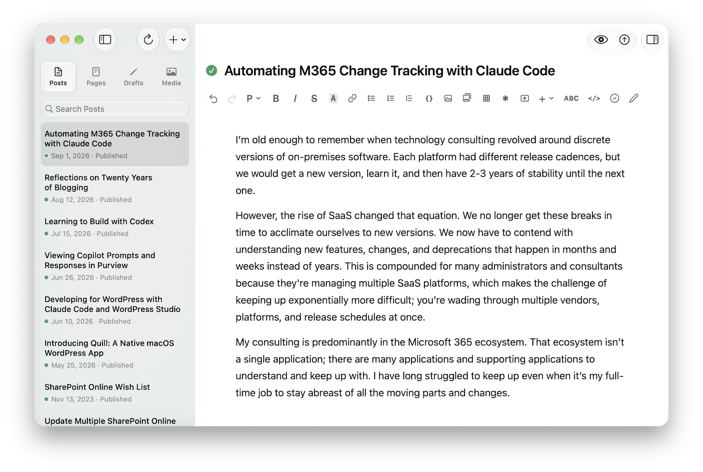

# Quill

A native macOS app for writing and managing WordPress content.

Quill connects to any self-hosted WordPress site through the built-in REST API and Application Passwords. No plugin, no third-party service, no subscription.

**[Download, documentation and changelog → quill.siolon.com](https://quill.siolon.com)**



## Requirements

- macOS 27 or later
- A self-hosted WordPress site running WordPress 7.0 or later, served over HTTPS
- WordPress.com is not supported

## Build

Building needs Swift 6.3.1 and a full Xcode install. `build.sh` compiles the asset catalog with `actool`, which the Command Line Tools alone do not provide.

```bash
./build.sh && open Quill.app
```

The test suite needs `node` and `jsdom` installed in `Scripts/`, not in the project root.

```bash
./test.sh
```

## Architecture

Start with [CLAUDE.md](CLAUDE.md). It maps `Sources/QuillKit`, records the key design decisions, and indexes the per-directory gotcha files. Longer notes live in [docs/](docs/).

## License

Quill is **not** open source. The source is published for reference and transparency under the terms in [LICENSE](LICENSE.md), which grants no right to modify, redistribute, or create derivative works.

Third-party components are listed in [NOTICES](NOTICES.md).
